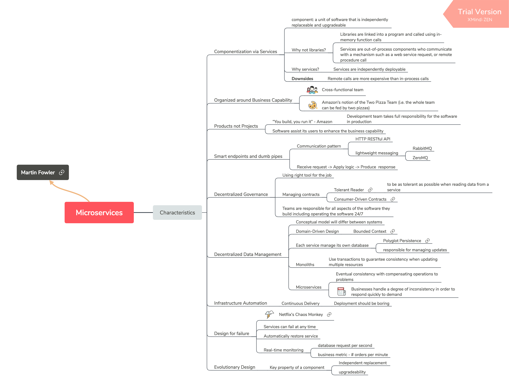

# 2018/08/28

### 1. [Microservices: a definition of this new architectural term](https://martinfowler.com/articles/microservices.html)

The article was written by [Martin Fowler](https://martinfowler.com) and [James Lewis](https://twitter.com/boicy), first published on Martin's 'personal' website on March 25, 2014.

It explained some key characteristics of a Microservice Architecture.

